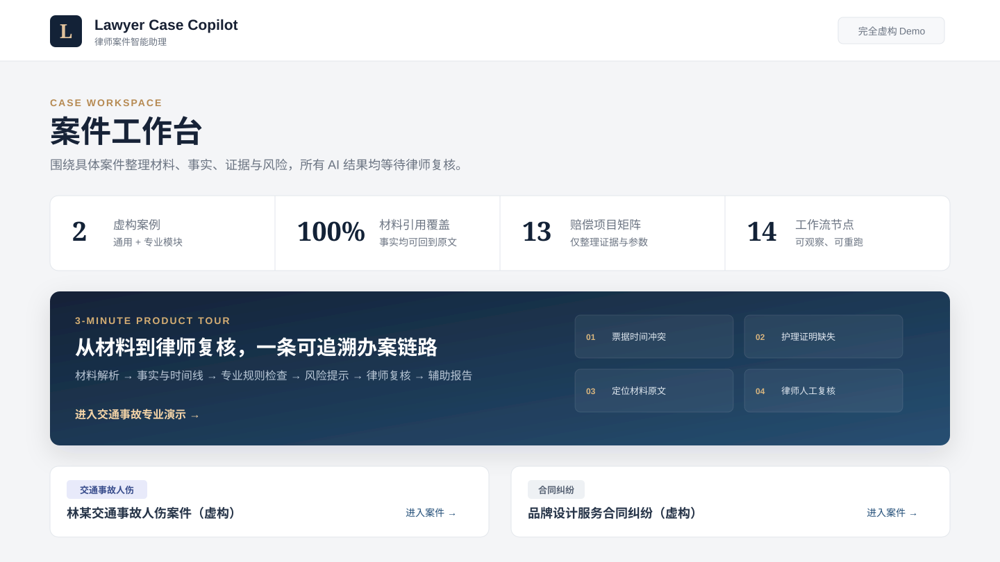

# Lawyer Case Copilot｜律师案件智能助理

[](https://github.com/samarailly51-pixel/lawyer-case-copilot/actions/workflows/ci.yml)
[](https://samarailly51-pixel.github.io/lawyer-case-copilot/)


面向案件负责律师的**可追溯案件工作空间**：以通用办案能力为底座，通过可插拔领域模块提供交通事故人伤案件的专业材料整理、证据检查和风险提示。

> 系统只提供办案辅助，不构成正式法律意见，不替代案件负责律师作出责任、因果关系、证据效力、鉴定或法律适用判断。



## 30 秒了解项目

| 维度 | 设计 |
|---|---|
| 产品形态 | 围绕具体案件运行的工作空间，不是普通法律问答机器人 |
| 通用能力 | 材料、事实、时间线、证据、任务、风险、来源引用和人工复核 |
| 专业能力 | 交通事故责任、伤情治疗、医疗费用、赔偿项目和证据完整性 |
| Agent 架构 | 一个 Workflow Orchestrator + 结构化节点 + 可插拔 Domain Plugin |
| 可信机制 | 原始材料、AI 事实、模型建议、知识引用和律师结论严格分层 |
| 演示数据 | 两个完全虚构案例；不包含真实客户、案件或未经核实的法律结论 |

```text
材料上传 → 事实与时间线 → Domain Router → 交通事故专业检查
       → 证据与风险 → 律师人工复核 → 带引用的辅助报告
```

快速入口：[零冷启动作品集](https://samarailly51-pixel.github.io/lawyer-case-copilot/) · [一分钟视频](https://samarailly51-pixel.github.io/lawyer-case-copilot/#demo) · [产品 Case Study](docs/case-study.md) · [三分钟 Demo](docs/demo-script.md) · [面试讲解](docs/interview-guide.md) · [评测结果](docs/evaluation-report.md)

## MVP 能力

- 案件创建、类型路由、负责人及阶段管理；
- PDF、DOCX、图片、TXT/Markdown 材料上传、解析和自动分类；
- 带文件、页码和原文片段的事实提取；
- 时间线、证据矩阵、信息冲突及缺失材料提示；
- 交通事故基本信息、伤情治疗、医疗费用、保险信息整理；
- 13 类赔偿项目证据矩阵和 YAML 规则检查；
- Agent 节点状态、输入输出摘要、警告、重跑和历史运行；
- AI 结果接受、修改/驳回接口及审计日志；
- 通用案件和交通事故辅助分析报告；
- 无 API Key 可运行的确定性 Mock Provider；
- 两个完全虚构、自动加载的 Demo 案例。

第二阶段强化能力：

- PDF 页级切片和可选本地 Tesseract OCR；
- 文本质量、低 OCR 置信度和 Prompt Injection 检测；
- 外部模型案件材料发送的显式授权开关；
- 模型结构化事实抽取及原文引用逐条校验；
- 带来源、时间、地区、适用范围和核验人的知识导入 API；
- 案件质量评分、来源覆盖率和强制复核完成度。

企业化阶段能力：

- JWT 登录、scrypt 密码哈希和管理员初始化；
- 律所工作空间、多租户案件/知识隔离；
- `viewer / assistant / lawyer / admin` 四级权限；
- 本地 AES-GCM 可选加密与 S3/MinIO 兼容对象存储；
- 发往外部模型前的身份证、手机号、邮箱和银行卡号脱敏；
- 同步演示、进程内后台任务和数据库持久队列 Worker；
- DOCX、Markdown 报告导出；
- Alembic 基线迁移、PostgreSQL/MinIO 生产编排和 GitHub Actions CI。

可追溯复核增强：

- 材料文本预览、页码跳转、引用原文高亮和原始文件安全打开；
- 区分逐字匹配与近似定位，近似定位强制提示人工核对；
- 批量接受/驳回、可视化修改对比、复核历史和版本号；
- 报告材料引用目录，并同步导出到 DOCX/Markdown；
- 主体关系页、办案任务看板和任务状态更新；
- 交通事故赔偿参数情景测算，仅做输入参数的算术汇总；
- 律所成员与四级角色管理页面；
- 完全虚构的合同/交通事故结构化回归评测集，覆盖 Demo 与真实上传路径；
- 非 Demo 交通案件采用结构化 Schema、逐字来源校验和保守本地降级，不再复用展示案例固定事实；
- 上传恶意文件扫描、规则 Schema 校验、数据保留清理和生产准入门禁；
- 管理员设置页可查看生产配置阻断项。
- 评测与规则中心展示回归场景、事实来源覆盖、规则版本、文件哈希和真实业务评测边界；
- 工作流节点可展开查看输入/输出、耗时、警告、错误、规则快照和重跑替代关系；
- 外部模型仅对超时、HTTP 429 和 5xx 进行有限重试，其他错误立即进入保守降级；
- 知识检索支持“仅已核验且无过期风险”过滤。

## 技术架构

```text
React + Vite + TypeScript
           ↓
       FastAPI API
           ↓
Workflow Orchestrator → General / Traffic Injury Plugin
           ↓                    ↓
 SQLAlchemy + SQLite        YAML Rules
           ↓
SourceReference + HumanReview + AuditLog
```

MVP 采用模块化单体。节点是同一编排工作流中的结构化功能节点，并非互相对话的多个 Agent。SQLite 可通过 `DATABASE_URL` 换为 PostgreSQL。

## 本地运行

要求：Python 3.11+、Node.js 20+。

### Windows 一键启动

双击仓库根目录的 `start-demo.cmd`，或运行：

```powershell
powershell -ExecutionPolicy Bypass -File scripts/start-demo.ps1
```

脚本会创建隔离的 Python 虚拟环境、安装缺失依赖、启动前后端并打开 `http://localhost:5173`。停止：

```powershell
powershell -ExecutionPolicy Bypass -File scripts/stop-demo.ps1
```

如默认端口被其他项目占用，可使用隔离端口启动；脚本会在启动前检查冲突，不会覆盖未知服务：

```powershell
powershell -ExecutionPolicy Bypass -File scripts/start-demo.ps1 -BackendPort 8010 -FrontendPort 5180
```

macOS/Linux：

```bash
bash scripts/start-demo.sh
# 停止
bash scripts/stop-demo.sh
```

### 手动启动

### 1. 启动后端

```bash
cd backend
python -m venv .venv
# Windows: .venv\Scripts\activate
# macOS/Linux: source .venv/bin/activate
pip install -r requirements.txt
uvicorn main:app --reload --port 8000
```

首次启动会创建 `lawyer_case_copilot.db`，并加载两个完全虚构的 Demo 案例。API 文档位于 `http://localhost:8000/docs`。

### 2. 启动前端

```bash
cd frontend
npm install
npm run dev
```

打开 `http://localhost:5173`。

## 简历公开 Demo

项目采用双入口：

1. [GitHub Pages 静态作品集](https://samarailly51-pixel.github.io/lawyer-case-copilot/)：零冷启动、始终可访问，包含产品定位、界面截图、评测边界和一分钟视频；
2. Render 免费交互 Demo：展示完整 React + FastAPI 案件工作台，空闲后允许休眠。

`.github/workflows/pages.yml` 会在 `main` 分支的 `portfolio/` 发生变化时自动部署静态作品集。仓库同时包含 Render 免费公开 Demo 配置：

- `Dockerfile.render`：将 React 与 FastAPI 合并为一个同域服务；
- `render.yaml`：使用 Free 实例和 `/health` 健康检查；空闲 15 分钟后会休眠；
- `PUBLIC_DEMO_READ_ONLY=true`：服务端强制只读；
- `SEED_DEMO_DATA=true`：仅在公开只读环境加载虚构案例；真实案件生产环境必须关闭；
- `MODEL_PROVIDER=mock`：不调用外部模型；
- 完全虚构 Demo 数据，重新部署自动恢复。

部署方法和自定义域名步骤见 [Render 部署指南](docs/render-deployment.md)。

### 启用登录与权限

默认 `AUTH_MODE=disabled`，用于本地作品集 Demo。启用认证时设置：

```dotenv
AUTH_MODE=enabled
JWT_SECRET=请使用至少32字符的随机密钥
BOOTSTRAP_ADMIN_EMAIL=admin@your-lawfirm.com
BOOTSTRAP_ADMIN_PASSWORD=至少10位的初始密码
```

也可通过命令创建或重置管理员：

```bash
cd backend
python -m core.bootstrap_admin --email admin@your-lawfirm.com --password "your-secure-password"
```

| 角色 | 能力 |
|---|---|
| `viewer` | 查看当前工作空间案件、材料和报告 |
| `assistant` | 上传/分类材料、运行和重跑节点 |
| `lawyer` | 创建/修改案件、复核 AI 结果、维护知识资料 |
| `admin` | 律师权限以及工作空间、成员和角色管理 |

### Docker Compose

```bash
docker compose up --build
```

生产化参考编排（当前会被准入门禁阻止启动，直到必需配置和经律师核验的个人规则齐备）：

```bash
docker compose -f docker-compose.production.yml up --build
```

该编排启用 PostgreSQL、MinIO、ClamAV、JWT 认证、S3 存储和后台工作流模式。部署前必须配置密码、密钥、数据保留周期，并由律师补充至少一条通过校验的个人经验规则。详见 [内测与上线准入](docs/pilot-readiness.md)。

数据库迁移：

```bash
cd backend
alembic -c alembic.ini upgrade head
```

## 模型配置

默认值 `MODEL_PROVIDER=mock` 不调用外部模型。使用 OpenAI-compatible API 时，在本地 `.env` 或进程环境中设置：

```dotenv
MODEL_PROVIDER=openai-compatible
MODEL_BASE_URL=https://example.com/v1
MODEL_API_KEY=your-secret
MODEL_NAME=your-model
MODEL_MAX_RETRIES=2
ALLOW_EXTERNAL_MODEL_FOR_CASE_FILES=true
```

仓库不会读取或保存密钥到数据库。模型输出必须通过结构化 Schema，且关键结果仍需人工复核。默认 `ALLOW_EXTERNAL_MODEL_FOR_CASE_FILES=false`；仅配置模型密钥不会发送案件材料，必须由部署者显式授权。重试只覆盖超时、429 和 5xx，且最多五次；节点失败后的恢复采用可观察的单节点人工重跑。

本地图片 OCR 可选启用：

```dotenv
OCR_PROVIDER=tesseract
TESSERACT_CMD=C:\Program Files\Tesseract-OCR\tesseract.exe
```

运行环境还需安装 Tesseract 及中文语言包；扫描 PDF 会尝试用 `pypdfium2` 逐页渲染后进行本地 OCR。未启用或执行失败时，材料进入人工处理状态。

存储配置：

```dotenv
STORAGE_BACKEND=local
ENCRYPT_UPLOADS=true
# URL-safe Base64 编码的 32 字节密钥
STORAGE_ENCRYPTION_KEY=
```

生产环境可设置 `STORAGE_BACKEND=s3`，并配置 `S3_ENDPOINT_URL`、`S3_BUCKET` 和访问凭证。支持 AWS S3、MinIO 及其他兼容实现。

生产安全与保留策略示例：

```dotenv
MALWARE_SCAN_PROVIDER=clamav
MALWARE_SCAN_REQUIRED=true
DATA_RETENTION_DAYS=365
ENFORCE_PRODUCTION_READINESS=true
REQUIRE_PERSONAL_EXPERIENCE_RULES=true
```

管理员可调用 `GET /api/system/readiness` 或在“律所工作空间”页面查看准入项。数据删除默认只预览：

```bash
cd backend
python -m services.data_retention
# 确认候选案件及对象存储备份后才执行
python -m services.data_retention --execute --confirm DELETE-EXPIRED-CASES
```

## Demo 路径

推荐按三分钟故事线演示：

1. 从首页进入交通事故人伤虚构案例；
2. 查看事故责任、治疗时间线和医疗费用关联；
3. 发现住院日期与票据日期冲突、护理证明缺失；
4. 点击引用定位到材料页码和原文；
5. 在“Agent 执行”查看节点状态、警告和单节点重跑；
6. 在“律师复核”接受、修改或驳回 AI 输出；
7. 在报告中心查看引用目录和辅助报告。

逐句讲解见 [三分钟 Demo 脚本](docs/demo-script.md)。

## 测试

```bash
cd backend
python -m pytest -q
python -m evaluation.run_suite \
  --json-output ../evals/latest-results.json \
  --markdown-output ../docs/evaluation-report.md

cd ../frontend
npm run build
```

真实脱敏评测的空白模板和双人复核指引位于：

- `evals/real_case_annotation_template.jsonl`
- `evals/annotation-guideline.md`

模板不包含真实事实、业务规则或预设准确率。

## 当前限制

- 默认配置仍是免登录本地 Demo；认证、多租户和 S3 需通过环境变量启用；
- 图片默认不启用 OCR，可选择本地 Tesseract，不向外部 OCR 服务发送；
- 不内置未经核实的法律法规或赔偿计算参数；
- 已有 9 个完全虚构的 Demo/非 Demo 回归场景，但尚无律师标注的真实脱敏领域准确率评测集；
- 不生成正式法律意见、诉状或可直接提交法院的最终文书；
- Demo 数据、机构、姓名、编号和事实均为虚构。

代码已提供 ClamAV 接入、生产准入门禁和数据保留工具，但生产上线前仍需由组织完成等保/隐私合规评估、供应商数据处理协议、备份恢复演练、密钥托管、经律师标注的领域评测和规则确认。这些不能由代码仓库自行替代。

## 个人经验预留

- `backend/rules/traffic_injury/personal_experience_rules.yaml`
- `docs/traffic-injury-business-insights.md`
- `knowledge_base/traffic_injury/personal_experience/`

这些位置只包含结构说明，不包含擅自虚构的实际办案规则。

## 文档

- [产品定位](docs/product-positioning.md)
- [产品 Case Study](docs/case-study.md)
- [三分钟 Demo 脚本](docs/demo-script.md)
- [面试讲解指南](docs/interview-guide.md)
- [完全虚构评测结果](docs/evaluation-report.md)
- [评测数据与标注模板](evals/README.md)
- [系统架构](docs/architecture.md)
- [通用办案工作流](docs/general-workflow.md)
- [交通事故人伤工作流](docs/traffic-injury-workflow.md)
- [人工复核](docs/human-review.md)
- [安全边界](docs/safety-boundaries.md)
- [Demo 指南](docs/demo-guide.md)
- [企业部署](docs/enterprise-deployment.md)
- [安全运维](docs/security-operations.md)
- [内测与上线准入](docs/pilot-readiness.md)
- [Render 免费公开 Demo](docs/render-deployment.md)
